# 知识库管理产品需求文档 (PRD)

## 5. 详细功能说明

### 5.1 后台壳层与导航

#### 5.1.1 侧边栏与顶栏

| 字段     | 说明                                                             |
| -------- | ---------------------------------------------------------------- |
| 功能编号 | NAV-01                                                           |
| 功能描述 | 用户通过后台壳层进入语言资产下的知识库模块，并可看到当前模块高亮 |
| 前置条件 | 用户已登录智能翻译系统                                           |
| 优先级   | P0                                                               |

页面元素：

| 元素           | 类型 | 说明                   | 规则           |
| -------------- | ---- | ---------------------- | -------------- |
| 语言资产子菜单 | 菜单 | 术语库、语料库、知识库 | 知识库为选中态 |

交互逻辑：

无

验收标准：

- 知识库菜单在当前页面必须高亮。

### 5.2 知识库列表

#### 5.2.1 卡片列表与检索

| 字段     | 说明                                                                     |
| -------- | ------------------------------------------------------------------------ |
| 功能编号 | LIB-01                                                                   |
| 功能描述 | 用户查看有权限访问的知识库卡片，并通过关键词、创建人、排序快速定位目标库 |
| 前置条件 | 用户拥有知识库列表查看权限                                               |
| 优先级   | P0                                                                       |

数据展示规则：

| 字段     | 来源             | 展示规则                                 |
| -------- | ---------------- | ---------------------------------------- |
| 库名称   | 知识库主表       | 最多一行，超出省略，hover 展示完整名称   |
| 概要     | 知识库摘要字段   | 最多两行，超出省略，，hover 展示完整概要 |
| 语种     | 文档解析结果聚合 | 展示前 3 个，超出显示省略标记并 tooltip  |
| 标签     | 知识点/主题聚合  | 展示前 3 个，超出显示省略标记并 tooltip  |
| 涉密等级 | 知识库密级       | 显示“1-公开”等标准格式                 |
| 文档数   | 文档表统计       |                                          |
| 用户角色 | 协作成员关系     | 查看者、编辑者、管理者                   |
| 创建人   | 创建用户         | 显示姓名                                 |
| 创建时间 | 知识库创建时间   | 格式为 YYYY-M-D HH:mm                    |

页面元素：

| 元素       | 类型     | 说明                                 | 校验规则                                                                                                 |
| ---------- | -------- | ------------------------------------ | -------------------------------------------------------------------------------------------------------- |
| 资产 Tab   | Tab      | 术语库、语料库、知识库               | 知识库选中                                                                                               |
| 新建库     | 主按钮   | 打开新建知识库弹窗                   | 超级管理员、项目经理可见可用（与术语库、语料库权限一致)                                                  |
| 删除       | 次按钮   | 批量删除知识库                       | 未选择时禁用；***仅当前登录人为知识库管理者，可勾选知识库删除***  点击删除需要有二次确认弹 |
| 关键词     | 搜索框   | 搜索库名、知识点、概要               | 支持模糊搜索，去除首尾空格                                                                               |
| 创建人     | 搜索框   | 搜索创建人                           | 支持模糊搜索                                                                                             |
| 查询       | 按钮     | 提交筛选条件                         | 请求中 loading 防重复点击                                                                                |
| 重置       | 按钮     | 清空筛选条件                         | 恢复默认排序和第一页                                                                                     |
| 排序       | 菜单按钮 | 默认、创建时间、更新时间、库名升降序 | 当前排序态高亮，默认按照创建时间倒序排列                                                                 |
| 知识库卡片 | 卡片     | 展示库概要和所有者信息               | 查看者、编辑者复选框禁用                                                                                 |
| 分页       | 分页器   | 总数、页码、每页条数                 | 默认 20 条/页                                                                                            |
| 空状态     | 展示     | 无匹配知识库时展示                   | 搜索结果为空触发                                                                                         |

查询规则：

1. ***列表只返回“当前用户为管理者、编辑者或查看者”的知识库。***
2. ***列表只返回“知识库密级小于等于人员密级”的知识库。***
3. 关键词为空时不过滤关键词。
4. 创建人为空时不过滤创建人。
5. 变更筛选或排序后页码重置为第 1 页。
6. 后端必须执行权限和密级过滤，前端禁用态只作为体验提示。

交互逻辑：

1. 用户进入知识库页，系统加载默认列表。
2. 用户输入关键词或创建人后点击查询，列表刷新。
3. 用户点击重置，清空搜索条件并刷新列表。
4. 用户点击排序按钮，选择排序方式，列表按所选字段刷新。
5. 用户点击库名称，进入该知识库文档解析页。
6. 用户勾选管理者权限的知识库后，可执行批量删除。

异常处理：

| 异常场景         | 处理方式                 |
| ---------------- | ------------------------ |
| 查询无结果       | 展示“暂无知识库”空状态 |
| 用户无任何知识库 | 展示空状态               |

页面截图：

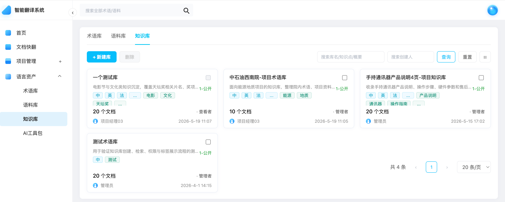

#### 5.2.2 知识库概述与知识点标签展示

| 字段     | 说明                                                              |
| -------- | ----------------------------------------------------------------- |
| 功能编号 | LIB-10                                                            |
| 功能描述 | 将知识点标签收纳到知识库概述的 hover 浮层中，降低卡片信息展示密度 |
| 前置条件 | 知识库存在概要或知识点标签                                        |
| 优先级   | P0                                                                |

展示规则：

1. 知识库卡片默认不直接展示知识点标签，仅保留库名称、概述、语种、密级、文档数、角色、创建人和创建时间信息。
2. 知识库概述默认单行省略，避免标签数量变化导致卡片高度变化。
3. 用户将鼠标 hover 到知识库概述时，系统展示概述浮层。
4. 浮层内先展示完整知识库概述，再展示该知识库的全部知识点标签。
5. 知识点标签在浮层内自动换行，不超过浮层最大宽度。
6. 知识库没有知识点标签时，浮层仅展示完整概述，不展示空标签区域。

页面截图：

验收标准：

- 知识点标签不再占用知识库卡片常驻展示空间。
- hover 或键盘聚焦概述后，可以看到完整概述和全部知识点标签。
- 浮层展示或隐藏时，知识库卡片尺寸和列表布局不得发生跳动。

### 5.3 知识库创建与维护

#### 5.3.1 新建知识库

| 字段     | 说明                                                   |
| -------- | ------------------------------------------------------ |
| 功能编号 | KBC-01                                                 |
| 功能描述 | 用户填写库名称和涉密等级创建知识库，可同步导入初始文件 |
| 前置条件 | 用户为超级管理员或项目经理（与术语库、语料库逻辑一致)  |
| 优先级   | P0                                                     |

页面元素：

| 元素             | 类型   | 说明                           | 校验规则                                                                                                                                                                                                                                                       |
| ---------------- | ------ | ------------------------------ | -------------------------------------------------------------------------------------------------------------------------------------------------------------------------------------------------------------------------------------------------------------- |
| 库名称           | 输入框 | 知识库名称                     | 必填，1-50 字，不允许全空格，同租户下不可重复                                                                                                                                                                                                                  |
| 涉密等级         | 下拉框 | 公开、内部、秘密               | 必选，***仅展示小于等于人员密级的选项***                                                                                                                                                                                                               |
| 导入文件         | 上传区 | 可选，支持文件、文件夹、拖拽   | 详见 5.4 上传规则                                                                                                                                                                                                                                              |
| 批量设置涉密等级 | 下拉框 | 为上传文件列表统一设置文件密级 | ***可选密级≤知识库的密级 当系统配置支持密级修改，则可所有文件进行密级修改 当系统配置不支持密级修改，则只可修改未设置密级的文件的密级***  已经上传文件且设置了密级，再修改库密级，且存在文件密级大于库铭记，系统给出弹窗提示xxxxxx |
| 文件队列         | 列表   | 文件名、大小、密级、状态、删除 | 长文件名省略并 tooltip                                                                                                                                                                                                                                         |
| 取消             | 按钮   | 关闭弹窗并清空临时文件         | ***如果文件列表已经存在文件，弹窗提示：已关联文件，关闭后文件清空***                                                                                                                                                                                   |
| 确定             | 主按钮 | 提交创建                       | 名称、库密级、上传文件密级均有值后可点击                                                                                                                                                                                                                       |

交互逻辑：

1. 用户点击“新建库”打开弹窗。
2. 系统聚焦库名称输入框。
3. 用户填写库名称并选择涉密等级。
4. 用户可选择上传文件或文件夹，也可不上传文件直接创建空库。
5. 若上传文件，用户必须为每个文件设置密级。
6. 文件设置密级后开始上传文件。
7. 点击确定后，系统先创建知识库。
8. 创建成功后进入文档解析页。
9. 若文件已上传，文档解析页展示文档的解析状态。

页面截图：

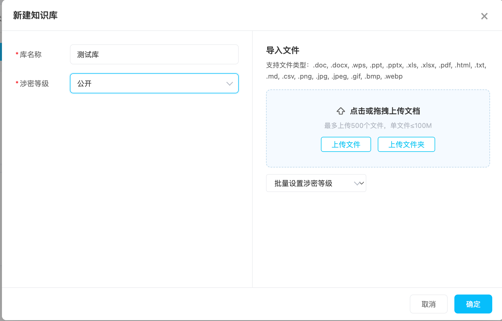

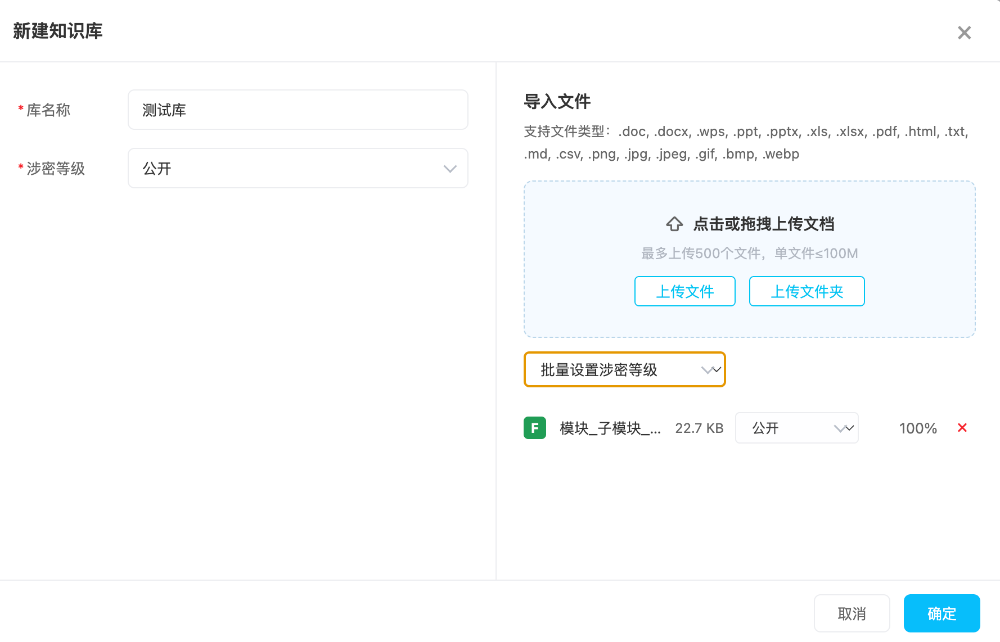

异常处理：

| 异常场景         | 处理方式                                |
| ---------------- | --------------------------------------- |
| 库名称重复       | 阻止提交，提示“库名称已存在”          |
| 未选择库密级     | 确定按钮禁用                            |
| 有文件未设置密级 | 确定按钮禁用                            |
| 重复点击提交     | 按钮 loading 并禁用，后端按请求 ID 幂等 |

验收标准：

- 创建成功后必须能在列表中看到新增知识库。
- 新建库若带文件，必须能在文档解析页看到解析状态。
- 用户不能创建高于本人密级的知识库。

#### 5.3.2 编辑知识库信息

| 字段     | 说明           |
| -------- | -------------- |
| 功能编号 | KBC-03         |
| 功能描述 | 修改知识库名称 |
| 前置条件 | 无             |
| 优先级   | P0             |

规则：

1. 库名称必填，1-50 字，不允许全空格。
2. 同租户同类型下库名称不可重复。
3. 涉密等级本期禁用编辑，避免随意降密或升密导致访问范围变化。
4. 编辑成功后同步刷新标题、列表卡片中的库名

页面截图：

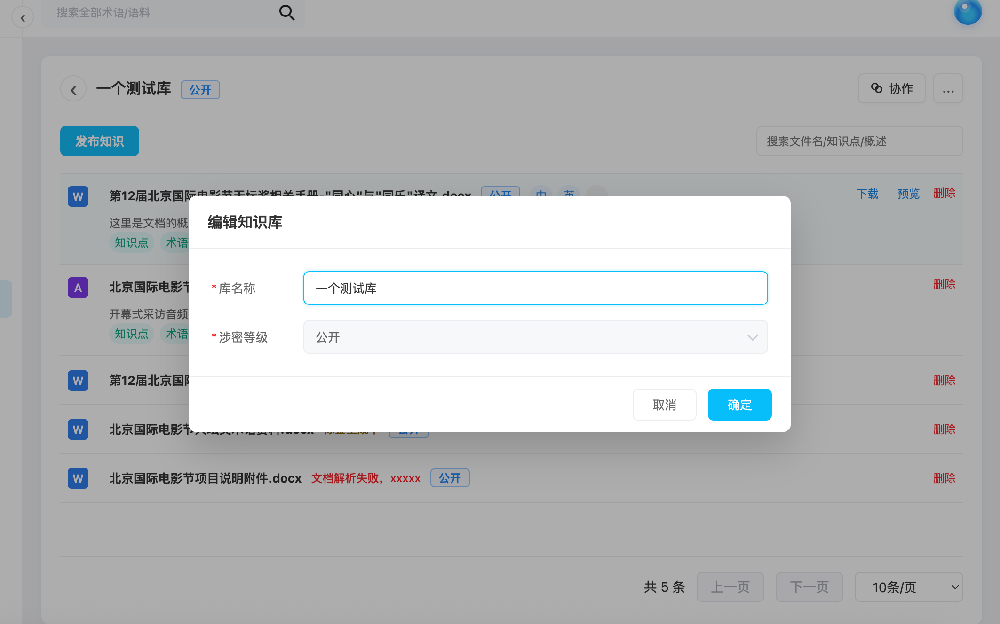

#### 5.3.3 清空知识库

| 字段     | 说明                                         |
| -------- | -------------------------------------------- |
| 功能编号 | KBC-04                                       |
| 功能描述 | 清空库内文档、解析结果和切片，但保留知识库壳 |
| 前置条件 | 无                                           |
| 优先级   | P0                                           |

规则：

1. 清空操作必须二次确认，建议输入库名称确认。
2. 清空成功后文档解析列表展示空状态。

页面截图：

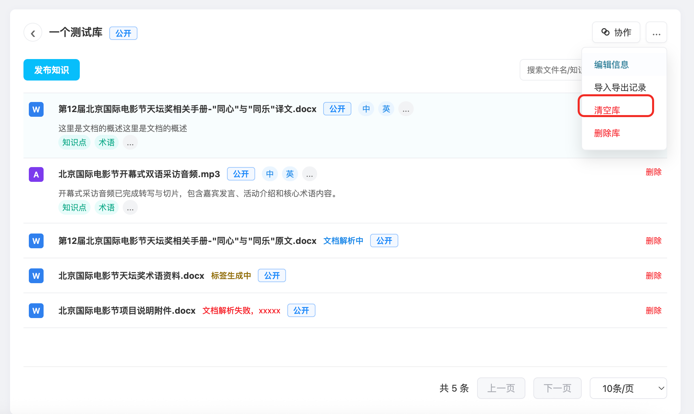

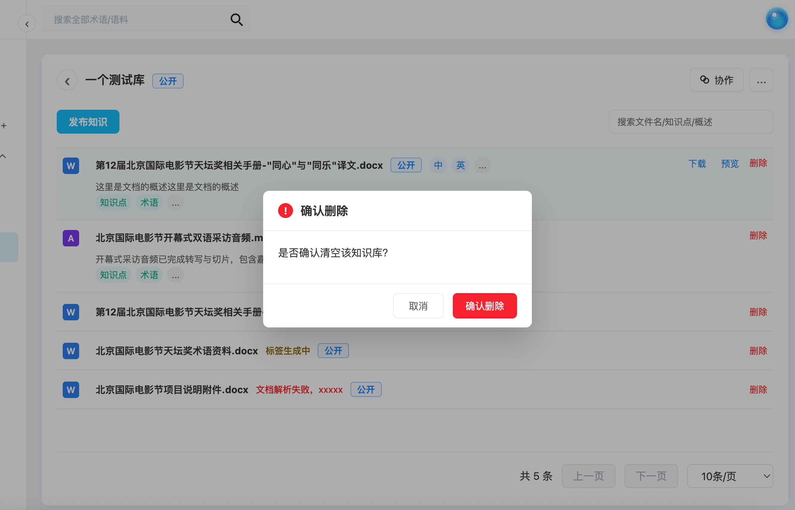

#### 5.3.4 删除知识库

| 字段     | 说明                   |
| -------- | ---------------------- |
| 功能编号 | KBC-05                 |
| 功能描述 | 删除知识库及其关联内容 |
| 前置条件 | 无                     |
| 优先级   | P0                     |

规则：

1. 删除知识库默认采用软删除。
2. 删除成功后返回知识库列表。
3. 列表中不再展示已删除知识库。
4. 后端必须实现幂等，重复请求不得造成异常。

页面截图：

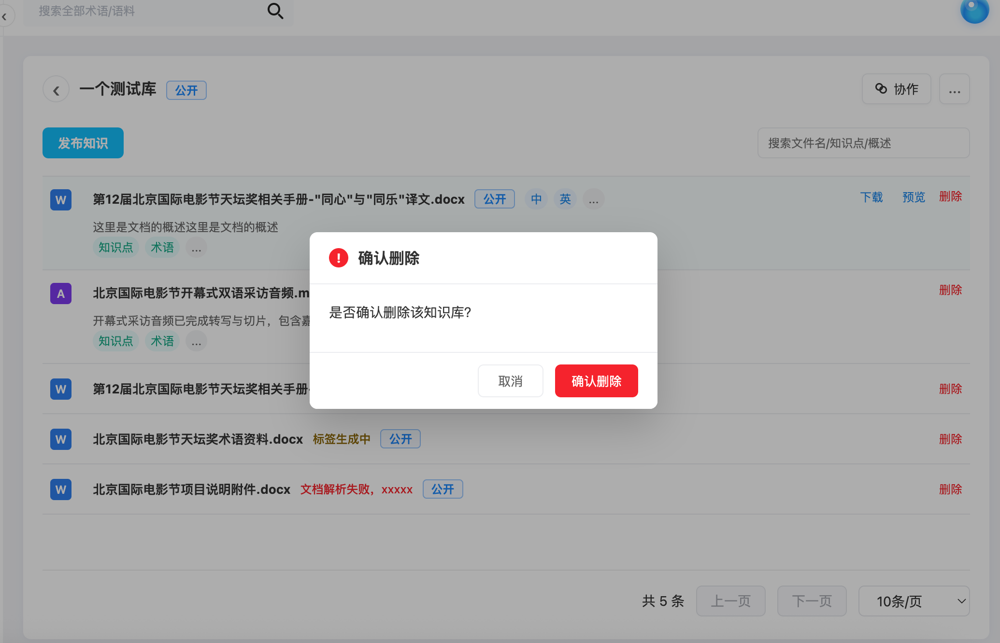

### 5.4 文件上传与发布知识

#### 5.4.1 上传面板

| 字段     | 说明                                         |
| -------- | -------------------------------------------- |
| 功能编号 | UP-01                                        |
| 功能描述 | 用户通过文件、文件夹或拖拽方式导入知识源文档 |
| 前置条件 | 用户拥有对应知识库导入权限                   |
| 优先级   | P0                                           |

支持格式：（***由研发提供具体支持拓展名)***

| 类型     | 扩展名                                    |
| -------- | ----------------------------------------- |
| 文档     | .doc, .docx, .wps, .pdf, .txt, .md, .html |
| 表格     | .xls, .xlsx, .csv                         |
| 演示文稿 | .ppt, .pptx                               |
| 图片     | .png, .jpg, .jpeg, .gif, .bmp, .webp      |

上传限制：

| 限制项       | 要求                                                                                                                                                                                                                                                                                                                                                                                         |
| ------------ | -------------------------------------------------------------------------------------------------------------------------------------------------------------------------------------------------------------------------------------------------------------------------------------------------------------------------------------------------------------------------------------------- |
| 单次文件数量 | 最多 500 个（***由研发提供***)                                                                                                                                                                                                                                                                                                                                                       |
| 单文件大小   | 不超过 100MB（***由研发提供***)                                                                                                                                                                                                                                                                                                                                                      |
| 文件密级     | ***每个文件必须设置密级后才可上传 当商户配置了支持更新密级，文件上传后可以对密级进行修改 当商户配置了不支持更新密级，文件上传后不可对密级进行修改  支持批量设置文件密级 当商户配置了支持更新密级，批量设置密级可修改所有文件数据 当商户配置了不支持更新密级，批量设置可修改未设置密级的文件数据   可选择的密级小于等于本知识库的密级*** |
| 上传中状态   | 上传中不可删除、不可修改密级                                                                                                                                                                                                                                                                                                                                                                 |

交互逻辑：

1. 用户点击“上传文件”“上传文件夹”或拖拽文件进入上传区。
2. 系统校验数量、大小、类型、空文件。
3. 用户逐个设置密级，或通过批量设置密级统一处理。
4. 文件设置密级后可进入上传。
5. 上传完成后系统创建解析任务。
6. 上传失败时展示失败状态和原因。

页面截图：

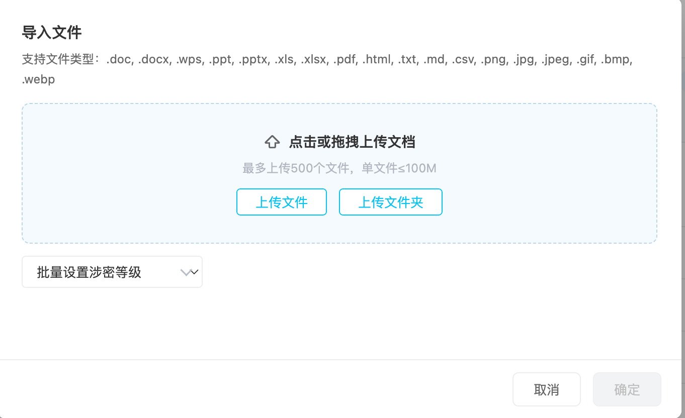

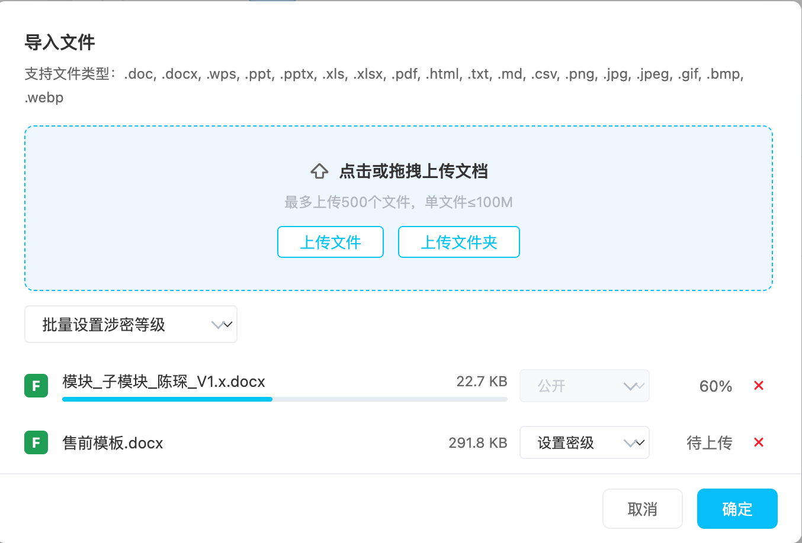

异常处理：

| 异常场景                                   | 处理方式                                        |
| ------------------------------------------ | ----------------------------------------------- |
| 文件类型不支持（***由研发提供***)  | 阻止加入队列并提示支持类型                      |
| 文件超过 100MB（***由研发提供***)  | 阻止上传并提示限制                              |
| 超过 500 个文件（***由研发提供***) | 只加入前 500 个并提示超出数量                   |
| 文件名重复                                 | 允许上传，但后端生成唯一文件 ID；列表可提示同名 |

验收标准：

- 上传前后端必须双重校验格式、大小、数量、密级。
- 上传队列必须展示文件名、大小、密级、状态和删除入口。
- 上传失败不得影响已成功文件。

### 5.5 文档解析管理

#### 5.5.1 解析列表

| 字段     | 说明                                                                     |
| -------- | ------------------------------------------------------------------------ |
| 功能编号 | DOC-01                                                                   |
| 功能描述 | 用户查看库内文档处理状态、概述、密级、语种、知识点标签、创建人和更新时间 |
| 前置条件 | 用户进入知识库详情页                                                     |
| 优先级   | P0                                                                       |

页面元素：

| 元素     | 类型   | 说明                                                                                                     | 规则                   |
| -------- | ------ | -------------------------------------------------------------------------------------------------------- | ---------------------- |
| 返回按钮 | 按钮   | 返回知识库列表                                                                                           | 保留列表筛选状态       |
| 库标题   | 文本   | 展示库名称                                                                                               | 长名称省略 tooltip     |
| 密级标签 | 标签   | 展示库密级                                                                                               | 颜色加文字             |
| 协作     | 按钮   | 打开协作弹窗                                                                                             | 协作人员管理           |
| 更多操作 | 菜单   | 编辑信息、导入导出记录、清空库、删除库                                                                   | 危险操作红色           |
| 发布知识 | 主按钮 | 打开上传面板                                                                                             |                        |
| 文档搜索 | 搜索框 | 搜索文件名、知识点、概述                                                                                 |                        |
| 文档行   | 列表项 | 文件类型、文件名、状态、密级、摘要、语种、创建人、更新时间、版本号（***如果有历史版本***）、操作 | 点击支持格式进入切片页 |
| 文档分页 | 分页器 | 总数、上一页、下一页、每页条数                                                                           | 服务端分页             |

解析状态：

| 状态       | 展示                   | 可操作                                                          |
| ---------- | ---------------------- | --------------------------------------------------------------- |
| 文档解析中 | 状态标签“文档解析中” | 可删除                                                          |
| 标签生成中 | 状态标签“标签生成中” | 可删除                                                          |
| 完成       | 概述、语种、知识点标签 | 可下载、预览、进入切片、删除、查看历史版本（如果文件有历史版本) |
| 失败       | 失败原因               | 可删除                                                          |

交互逻辑：

1. 用户进入文档解析页，系统加载当前库信息和文档列表。
2. 用户点击发布知识，打开上传弹窗。
3. 用户在文档搜索框输入关键词，系统过滤文件名、知识点、概述。
4. 用户点击解析完成且支持的文档行，进入切片内容页。
5. 用户点击音频等不支持切片的格式，系统提示“当前格式不支持查看切片”。
6. 用户点击预览。
   1. ***如果该文件来自项目管理、文档快翻模块，且有译文文档，进入双语对照预览；否则只展示原文预览***
7. 用户点击删进行二次确认
8. 每条文档记录展示创建人和更新时间；历史版本展示对应版本的更新时间。

页面截图：

异常处理：

| 异常场景     | 处理方式                             |
| ------------ | ------------------------------------ |
| 解析服务失败 | 展示失败原因，允许删除               |
| 标签生成失败 | 展示文档解析完成但标签失败，允许删除 |
| 文档解析失败 | 保留文档行，提示失败原因             |
| 文档数量过多 | 服务端分页，搜索结果分页加载         |

验收标准：

- 文档状态与后台任务状态一致。
- 完成态文档必须展示概述、语种和知识点标签。
- 所有状态的文档记录必须展示创建人和更新时间。
- 文档删除时必须有确认弹窗。

#### 5.5.2 文档概述与知识点标签展示

| 字段     | 说明                                                            |
| -------- | --------------------------------------------------------------- |
| 功能编号 | DOC-10                                                          |
| 功能描述 | 将文档知识点标签收纳到概述 hover 浮层中，保持文档列表紧凑易扫描 |
| 前置条件 | 文档解析完成并已生成概述或知识点标签                            |
| 优先级   | P0                                                              |

展示规则：

1. 文档解析列表默认不在文档行中直接展示知识点标签。
2. 解析完成的文档常驻展示文档概述，概述超出可用宽度时单行省略。
3. 用户 hover 文档概述时，系统展示完整概述和全部知识点标签。
4. 知识点标签展示在完整概述下方，并按标签数量自动换行。
5. 文档处于文档解析中、标签生成中或解析失败状态时，不展示概述 hover 浮层。
6. 标签生成完成后，文档行自动更新为可查看概述和知识点的完成状态。

页面截图：

验收标准：

- 文档行中不再常驻展示知识点标签。
- hover 或键盘聚焦文档概述后，可以查看完整概述和全部知识点标签。

#### 5.5.3 文档版本维护

| 字段     | 说明                                                                               |
| -------- | ---------------------------------------------------------------------------------- |
| 功能编号 | DOC-11                                                                             |
| 功能描述 | 对从文档快快翻、项目管理中维护的多个版本的文档进行归组和展示，主列表仅保留最新版本 |
| 前置条件 | 同一知识库中存在文档的多个版本                                                     |
| 优先级   | P0                                                                                 |

版本定义：

| 概念         | 定义                                         |
| ------------ | -------------------------------------------- |
| 文档组       | 从文档快快翻、项目管理中维护的多个版本的集合 |
| 最新版本     | 当前文档组中版本号最大的版本                 |
| 历史版本     | 除最新版本外的其他版本                       |
| 版本号       | 采用正整数递增，界面显示为 V1、V2、V3        |
| 最新版本标签 | 将状态和版本号合并展示，例如“最新版本 V3”  |

主列表展示规则：

1. 同一文档存在多个版本时，文档解析列表最外层只展示最新版本。
2. 最新版本必须展示标签“最新版本 Vn”，状态文字和版本号放在同一个标签中。
3. 最新版本处于“标签生成中”等处理中状态时，同时展示“最新版本 Vn”和当前处理状态。
4. 没有历史版本的文档不展示版本号、最新版本标签和历史版本入口。
5. 允许同时存在以下两类数据：
   - 有历史版本：展示“最新版本 Vn”
   - 无历史版本：不展示任何版本相关信息。
6. 有历史版本的文档在操作区展示“历史版本”按钮。
7. 最新版本仍按其当前处理状态控制下载、预览、切片和删除等操作。

历史版本弹窗：

| 元素         | 类型      | 说明                                     | 规则                         |
| ------------ | --------- | ---------------------------------------- | ---------------------------- |
| 弹窗标题     | 文本      | 固定展示“历史版本”                     | 不重复展示当前文件名         |
| 关闭         | 图标/按钮 | 关闭弹窗                                 | 支持右上角关闭和底部关闭按钮 |
| 历史版本列表 | 列表      | 展示该文档的全部历史版本                 | 按版本号倒序排列             |
| 版本标签     | 标签      | 展示 V2、V1 等版本号                     | 与密级标签区分               |
| 文件信息     | 文档行    | 文件类型、文件名、密级、语种、概述、操作 | 与主列表文档行保持一致       |

历史版本交互规则：

1. 用户点击“历史版本”按钮打开弹窗。
2. 弹窗只展示历史版本，不重复展示主列表中的最新版本。
3. 历史版本按照版本号从大到小排列，例如 V2、V1。
4. 历史版本可执行删除、下载、预览和进入切片内容。
5. 历史版本不展示“最新版本”标签。
6. 用户点击历史版本行的“删除”后，系统弹出二次确认弹窗。
7. 二次确认弹窗展示文件名、版本号和“删除后无法恢复”提示。
8. 用户确认删除后，该历史版本从弹窗列表中移除；用户取消时不执行删除。
9. 弹窗关闭后，用户仍停留在原文档解析列表和原滚动位置。
10. 删除最新版本的数据后，将剩余历史版本中版本号最大的版本提升为最新版本。

页面截图：

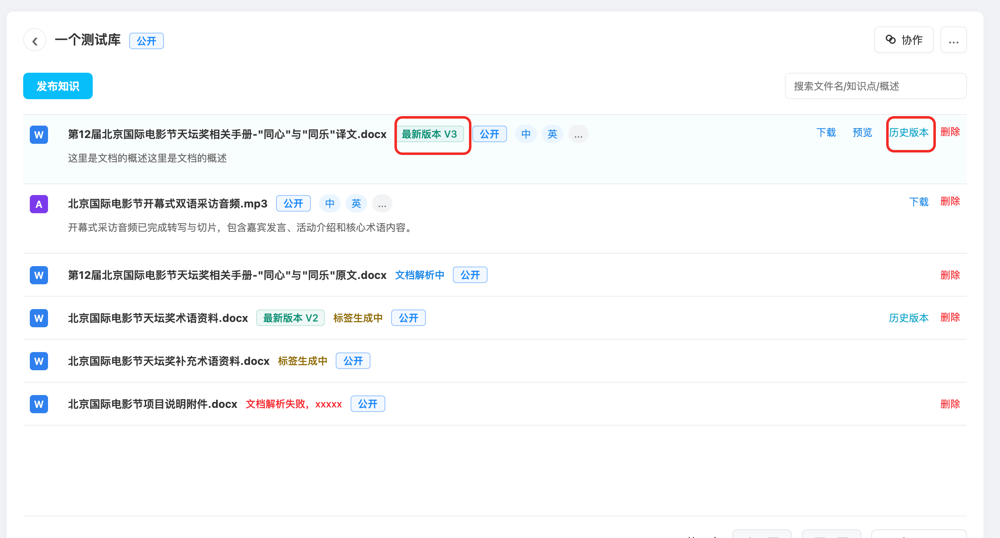

异常处理：

| 异常场景           | 处理方式                                    |
| ------------------ | ------------------------------------------- |
| 历史版本查询为空   | 展示“暂无历史版本”，不展示空文档行        |
| 最新版本处理中     | 保留历史版本入口，最新版本按处理状态展示    |
| 历史版本无预览内容 | 禁用预览或提示“当前版本暂不支持预览”      |
| 重复提交删除       | 确认按钮 loading 并禁用，后端按请求 ID 幂等 |

验收标准：

- 主列表中同一文档只展示最新版本。
- 最新版本状态与版本号合并为一个“最新版本 Vn”标签。
- 历史版本弹窗按版本号倒序展示，且文档行信息与主列表一致。
- 版本标签、密级标签、语种标签在颜色和语义上可明显区分。
- 删除历史版本必须经过二次确认。

### 5.6 文档预览

#### 5.6.1 原译对照预览

| 字段     | 说明                                       |
| -------- | ------------------------------------------ |
| 功能编号 | PRE-01                                     |
| 功能描述 | 用户查看原文、译文或原译对照内容           |
| 前置条件 | 文档解析完成，格式支持预览，用户有查看权限 |
| 优先级   | P0                                         |

页面元素：

| 元素         | 类型 | 说明                                                                                                                                                         | 规则       |
| ------------ | ---- | ------------------------------------------------------------------------------------------------------------------------------------------------------------ | ---------- |
| 原译对照 Tab | Tab  |  左右分栏展示原文和译文 ***点击预览，新开浏览器页面 如果文件来源为：文档快翻、项目管理且有译文，则跳转原译对照tab，否则弹出原文tab*** | 默认选中   |
| 原文 Tab     | Tab  | 仅展示原文                                                                                                                                                   |            |
| 译文 Tab     | Tab  | 仅展示译文                                                                                                                                                   |            |
| 刷新         | 按钮 | 重新拉取预览内容                                                                                                                                             | 请求中禁用 |
| 退出预览     | 按钮 | 返回文档解析页                                                                                                                                               |            |

页面截图：

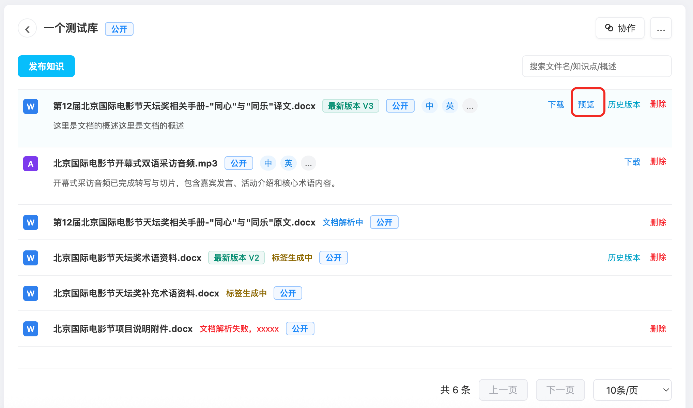

异常处理：

| 异常场景       | 处理方式                   |
| -------------- | -------------------------- |
| 预览内容生成中 | 展示加载状态和刷新按钮     |
| 格式不支持预览 | 提示“当前格式不支持预览” |
| 内容加载失败   | 展示错误原因和重试按钮     |
| 权限不足       | 拦截并提示无权限           |

### 5.7 切片内容管理

#### 5.7.1 切片列表与 CRUD

| 字段     | 说明                                                 |
| -------- | ---------------------------------------------------- |
| 功能编号 | CHK-01                                               |
| 功能描述 | 用户维护文档解析出的知识切片，控制内容质量和启用状态 |
| 前置条件 | 文档解析完成且格式支持切片                           |
| 优先级   | P0                                                   |

页面元素：

| 元素       | 类型   | 说明                       | 校验规则                                         |
| ---------- | ------ | -------------------------- | ------------------------------------------------ |
| 文件标题   | 文本   | 展示来源文件名、类型和密级 | 长文件名省略 tooltip                             |
| 版本标签   | 标签   | 展示当前切片所属文档版本   | 最新版本显示“最新版本 Vn”，历史版本显示 `Vn` |
| 新增       | 主按钮 | 打开新增切片弹窗           |                                                  |
| 批量删除   | 次按钮 | 删除已选切片               | 未选择时禁用                                     |
| 已选择数量 | 文本   | 展示已选 N 项              | 与复选框同步                                     |
| 状态筛选   | 下拉   | 全部、启用、停用           | 默认全部                                         |
| 内容搜索   | 搜索框 | 按切片内容检索             | ***关键词高亮***                         |
| 分页跳转   | 分页器 | 每页条数、页码、跳转       | 页码合法校验                                     |

新增/编辑弹窗：

| 元素       | 类型     | 说明                 | 校验规则                                         |
| ---------- | -------- | -------------------- | ------------------------------------------------ |
| 切片块内容 | 文本域   | 切片文本             | 必填，最长 5000 字                               |
| 上传图片   | 上传控件 | 为切片补充图片       | 非必传，png/jpg/jpeg，最多 5 张，单张不超过 50MB |
| 启用状态   | Switch   | 控制是否参与知识使用 | 默认启用                                         |
| 保存       | 主按钮   | 保存新增或编辑       | 内容非空才可点击                                 |

业务规则：

1. 新增切片默认启用。
2. 停用切片不参与检索、问答、推荐等下游使用，但保留在管理列表。
3. 删除切片采用软删除。
4. 批量删除必须二次确认，并明确展示删除数量。
5. 切片内容变更后需更新文档的切片更新时间和知识库更新时间。
6. 图片附件只作为切片补充材料，不改变文档密级。
7. 当前文档存在历史版本且用户从主列表进入最新版本切片页时，文件头展示绿色“最新版本 Vn”标签。
8. 用户从历史版本弹窗进入切片页时，文件头展示紫灰色 `Vn` 标签，不展示“最新版本”文字。
9. 无版本信息的文档进入切片页时，不展示版本标签。

页面截图：

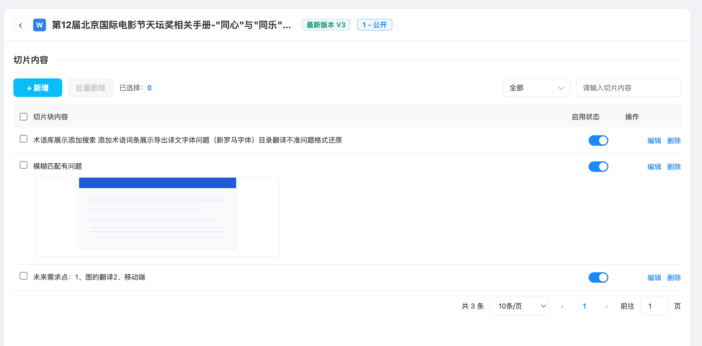

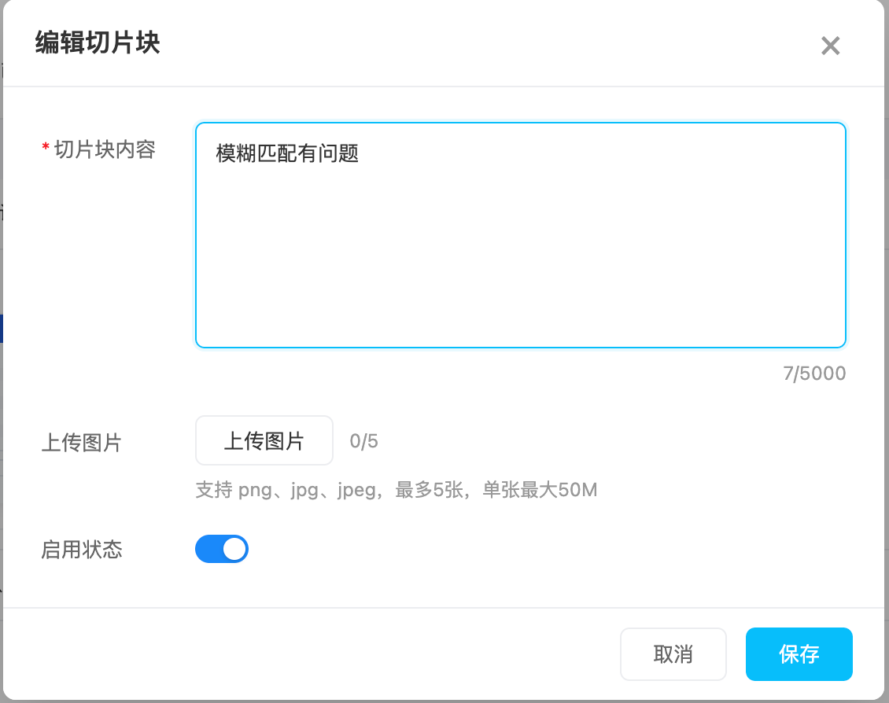

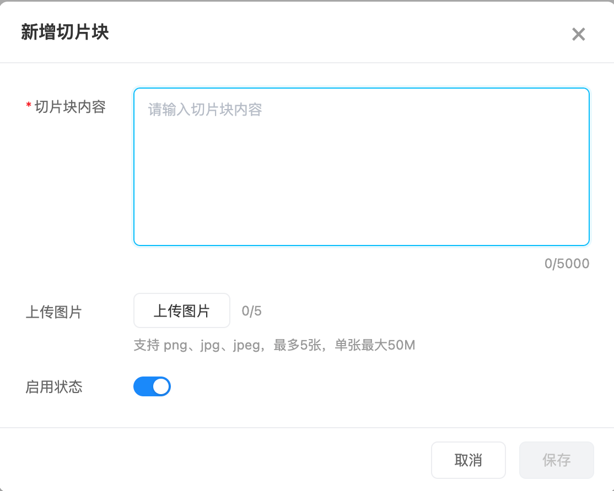

异常处理：

| 异常场景         | 处理方式                 |
| ---------------- | ------------------------ |
| 内容为空         | 保存按钮禁用，提交时提示 |
| 内容超过 5000 字 | 禁止继续输入或提示超限   |
| 图片类型不支持   | 不加入图片列表并提示     |
| 图片超过 50MB    | 不加入图片列表并提示     |
| 删除失败         | 保留切片并提示失败原因   |
| 启停失败         | 状态回滚并提示失败原因   |

验收标准：

- 新增、编辑、删除、启停后列表状态必须即时刷新。
- 切片内容为空不能保存。
- 批量删除数量与实际选中数量一致。
- 切片页文件头展示的版本信息必须与用户进入的文档版本一致。

### 5.8 导入导出记录

| 字段     | 说明                                                 |
| -------- | ---------------------------------------------------- |
| 功能编号 | DOC-09                                               |
| 功能描述 | 用户查看知识库维度的导入和导出记录，用于追踪数据流转 |
| 前置条件 | 用户拥有该知识库记录查看权限                         |
| 优先级   | P1                                                   |

页面元素：

| 元素     | 类型     | 说明                                                                                  | 校验规则                                         |
| -------- | -------- | ------------------------------------------------------------------------------------- | ------------------------------------------------ |
| 弹窗标题 | 文本     | 导入导出记录                                                                          | 固定标题，不展示库名                             |
| Tab      | Tab      | 导入记录、导出记录                                                                    | 当前 Tab 高亮                                    |
| 记录表格 | 表格     | 序号、文档、涉密等级、操作人、操作时间、状态、操作                                    | 长文档名省略 tooltip                             |
| 版本标签 | 标签     | 展示导入或导出操作对应的文档版本                                                      | 最新版本显示“最新版本 Vn”，历史版本显示 `Vn` |
| 状态     |          | 导入状态：导入中、 解析中、解析失败、已完成 导出状态：导出成功、导出中、导出失败 | 颜色加文字                                       |
| 下载     | 文字按钮 | 下载导出成功的文件                                                                    | 仅导出成功状态展示                               |
| 分页     | 分页器   | 总数与页码                                                                            | 服务端分页                                       |

版本展示规则：

1. 导入记录和导出记录均应关联操作发生时的文档版本。
2. 记录对应最新版本时，在文档名称后展示“最新版本 Vn”标签。
3. 记录对应历史版本时，在文档名称后展示紫灰色 `Vn` 标签。
4. 记录没有版本信息时，不展示版本标签。
5. 导出成功的记录在操作列展示“下载”，其他状态和导入记录不展示操作。

页面截图：

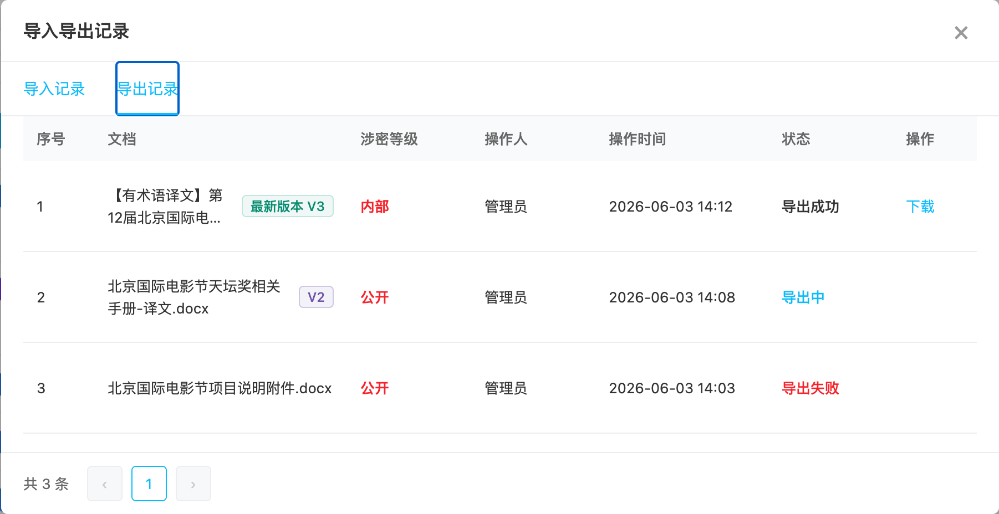

验收标准：

- 导入和导出记录可独立分页。
- 记录状态必须与真实任务状态一致。
- 导入、导出记录中的版本标签必须与实际操作文档版本一致。
- 仅导出成功记录提供下载入口。

### 5.9 协作入口

| 字段     | 说明                                                     |
| -------- | -------------------------------------------------------- |
| 功能编号 | KBC-06                                                   |
| 功能描述 | 用户从知识库详情页进入协作能力，用于查看或配置知识库成员 |
| 前置条件 | 用户进入知识库详情页                                     |
| 优先级   | P1                                                       |

本期说明：

1. ***与术语库语料库一致，知识库也提供查看者、编辑者、管理者三个角色***
2. ***查看者：只能查看知识库，可预览、下载文档，可查看导入、导出记录；不可编辑库的基本信息、不可删除库、清空库、不可删除文档、不可进入切片页面、不可发布知识，不可进入协作页面***
3. ***编辑者：可查看知识库，可预览、下载文档，可查看导入、导出记录；、不可删除库、清空库，只可删除创建人为自己的文档，只可进入创建人为自己的文档的切片页面并可在切片页面维护切片，可发布知识，不可进入协作页面***
4. ***管理者：拥有最高权限***
5. ***超级管理员拥有商户的所有的知识库的管理者权限***

截图说明：
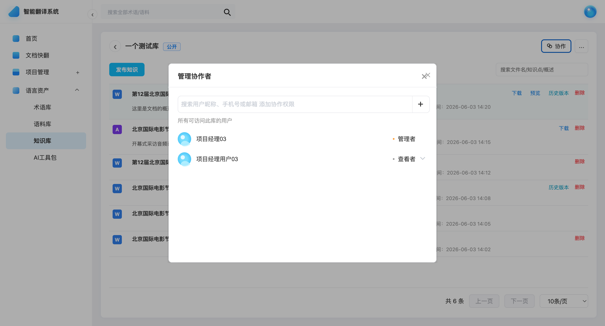
