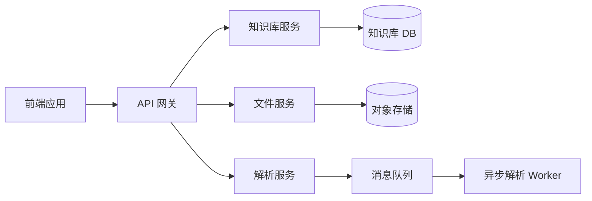

# 知识库管理 - 质量检查报告

## 检查说明

本报告按照 prd-writer skill 的四角色审查方法，从技术负责人、挑剔用户、运营负责人和测试工程师四个视角对知识库管理产品需求进行全面审查。

---

## 1. 技术负责人视角 🔧

### 审查问题与建议

| 序号 | 问题描述 | 风险等级 | 建议解决方案 | 优先级 |
| --- | --- | --- | --- | --- |
| 1.1 | 大文件上传可能超时，缺乏分片和断点续传机制 | 中高 | MVP 阶段限制单文件 ≤ 100MB，单次 ≤ 50 个文件；v1.2 版本引入分片上传和断点续传 | P1 |
| 1.2 | 大量切片渲染可能造成页面性能问题 | 中 | 超过 100 条切片时启用虚拟滚动；表格列固定，避免重排 | P1 |
| 1.3 | 文档预览存在 XSS 安全风险 | 高 | 所有用户生成内容必须经过 HTML 消毒库（如 DOMPurify）处理后再渲染；禁止执行任何内联脚本 | P0 |
| 1.4 | 并发上传缺乏队列控制 | 中 | 实现上传队列，最多 5 个并发，超出时排队等待；展示队列进度和状态 | P1 |
| 1.5 | 删除操作缺乏幂等性 | 中 | 后端接口实现幂等设计，使用唯一请求 ID 防止重复提交；前端按钮 loading 期间禁用 | P0 |
| 1.6 | 涉密数据传输和存储安全 | 高 | 涉密文档内容加密存储；传输使用 HTTPS；接口增加密级权限校验 | P0 |
| 1.7 | 搜索性能随数据量增长下降 | 中 | 引入全文检索引擎（如 Elasticsearch）；搜索结果分页加载 | P2 |

### 技术架构建议

---

## 2. 挑剔用户视角 👤

### 体验问题与改进

| 序号 | 问题描述 | 影响范围 | 建议改进方案 | 优先级 |
| --- | --- | --- | --- | --- |
| 2.1 | 长文件名两行省略仍看不清完整名称 | 全局 | 所有省略文本 hover 时展示 tooltip 显示完整内容 | P0 |
| 2.2 | 上传失败后需要重新选择所有文件 | 上传流程 | 支持失败文件单独重试，保留已成功文件，无需重新上传全部 | P1 |
| 2.3 | 清空库和删除库操作太容易误触 | 库级操作 | 确认弹窗要求输入库名称进行二次确认，增加操作成本；按钮倒计时 3 秒后才可点击 | P0 |
| 2.4 | 切片内容搜索没有关键词高亮 | 切片管理 | 搜索结果中关键词高亮显示，支持高亮跳转到匹配位置 | P1 |
| 2.5 | 解析中状态不知道还需要多久 | 文档解析 | 对于大文件，展示预估剩余时间或进度百分比；小文件展示加载动画即可 | P1 |
| 2.6 | 复选框禁用态没有说明原因 | 知识库列表 | 查看者角色的复选框 hover 时 tooltip 提示"您没有管理权限，无法选择" | P0 |
| 2.7 | 批量操作没有选中数量提示 | 切片管理 | 顶部显示"已选中 N 项"，批量删除确认框中明确说明将删除的数量 | P1 |
| 2.8 | 弹窗关闭没有撤销/恢复功能 | 编辑场景 | 重要编辑操作支持撤销恢复，或自动保存草稿 | P2 |

### 交互优化建议

| 优化点 | 当前状态 | 建议改进 |
| --- | --- | --- |
| 键盘快捷键 | 无 | 支持 Ctrl/Cmd + S 保存，Esc 关闭弹窗 |
| 拖拽排序 | 无 | 知识库卡片和切片支持拖拽调整顺序 |
| 批量选择 | 仅复选框 | 支持 Shift + 点击连续选择，Ctrl/Cmd + A 全选 |
| 右键菜单 | 无 | 表格行右键展示常用操作菜单 |

---

## 3. 运营负责人视角 📊

### 运营需求补充

| 序号 | 需求描述 | 业务价值 | 实现建议 | 优先级 |
| --- | --- | --- | --- | --- |
| 3.1 | 关键用户行为埋点缺失 | 高 | 增加以下埋点： - 新建知识库 - 上传文件成功/失败 - 文档解析成功/失败 - 查看切片/预览文档 - 删除操作（文档/切片/库） - 导出操作 | P0 |
| 3.2 | 知识质量数据缺失 | 中 | 统计并展示： - 切片数量与覆盖率 - 标签完整性 - 启用/停用切片比例 - 知识库健康度评分 | P1 |
| 3.3 | 使用统计报表缺失 | 中 | 增加管理后台统计： - 知识库访问量 TOP 排行 - 文档预览次数统计 - 切片编辑频率 - 用户活跃度统计 | P2 |
| 3.4 | 异常告警机制缺失 | 中高 | 解析失败率超过 20% 或上传失败过多时，自动告警通知管理员 | P1 |
| 3.5 | 知识库增长趋势分析 | 低 | 按时间维度展示知识库、文档、切片的增长趋势图 | P2 |
| 3.6 | 用户操作审计日志 | 高 | 完整记录所有用户操作，支持按用户、时间、操作类型查询审计 | P1 |

### 数据指标建议

| 指标类别 | 核心指标 | 目标值 |
| --- | --- | --- |
| 质量指标 | 文档解析成功率 | ≥ 95% |
| | 切片覆盖率 | ≥ 80% |
| | 标签完整率 | ≥ 70% |
| 性能指标 | 平均解析时间 | ≤ 30s/文档 |
| | 搜索响应时间 | ≤ 500ms |
| | 页面加载时间 | ≤ 3s |
| 使用指标 | 日活跃知识库数 | 根据业务规模 |
| | 人均日创建切片数 | ≥ 5 |
| | 知识库复用率 | TBD |

---

## 4. 测试工程师视角 🧪

### 边界场景与预期行为

| 序号 | 测试场景 | 测试类型 | 预期行为 | 优先级 |
| --- | --- | --- | --- | --- |
| 4.1 | 快速重复点击新建/提交按钮 | 功能 | 防止重复提交，按钮 loading 期间不可再次点击，不产生重复数据 | P0 |
| 4.2 | 上传 0 字节文件 | 边界 | 正确识别并 toast 提示"文件为空，请选择有效文件" | P1 |
| 4.3 | 网络中断后恢复上传 | 异常 | 支持断点续传或明确提示上传失败，不造成页面卡死 | P1 |
| 4.4 | 超大切片内容（10000+字符） | 边界 | 正确截断展示，不造成布局崩溃；编辑时完整展示 | P0 |
| 4.5 | 并发删除同一文档/切片 | 并发 | 后端处理竞态条件，不出现 500 错误，返回友好提示 | P1 |
| 4.6 | 密级为空或非法值 | 安全 | 前端和后端双重校验，拒绝非法密级，不写入数据库 | P0 |
| 4.7 | 无权限用户直接访问 URL | 安全 | 后端校验权限，返回 403 或重定向到无权限页面 | P0 |
| 4.8 | SQL 注入尝试 | 安全 | 所有查询使用参数化，不执行恶意 SQL | P0 |
| 4.9 | XSS 注入尝试 | 安全 | 预览和切片展示时转义 HTML，不执行注入脚本 | P0 |
| 4.10 | 浏览器后退/前进导航 | 兼容性 | 页面状态正确恢复，不出现白屏或数据丢失 | P1 |

### 测试用例分类统计

| 测试类型 | 预计用例数 | 重点测试模块 |
| --- | --- | --- |
| 功能测试 | ~80 | 知识库创建、文档上传、切片管理、权限控制 |
| 边界测试 | ~30 | 文件大小/数量限制、文本长度、空值处理 |
| 性能测试 | ~10 | 大列表渲染、并发上传、搜索响应 |
| 安全测试 | ~15 | 权限绕过、XSS、SQL 注入、涉密数据 |
| 兼容性测试 | ~15 | 主流浏览器、不同分辨率 |
| **总计** | **~150** | |

---

## 5. UI/UX 质量检查 🎨

### 视觉规范检查

| 检查项 | 当前状态 | 建议改进 | 优先级 |
| --- | --- | --- | --- |
| 5.1 | 图标一致性 | 基本一致 | 统一使用 Heroicons 或 Lucide 图标库，不混用 emoji | P1 |
| 5.2 | Hover 状态反馈 | 部分缺失 | 所有可点击元素必须有明确的 hover 状态（颜色/阴影/边框变化） | P0 |
| 5.3 | 禁用态清晰度 | 基本满足 | 禁用按钮和输入框增加更明显的视觉区分（降低透明度+不可点击光标） | P0 |
| 5.4 | 过渡动画 | 缺失 | 弹窗打开/关闭、状态变化增加 150-200ms 平滑过渡 | P1 |
| 5.5 | 颜色对比度 | 待验证 | 所有文本必须满足 WCAG AA 标准（对比度 ≥ 4.5:1） | P1 |
| 5.6 | 响应式布局 | 桌面优先 | 窄桌面（<1240px）允许横向滚动，避免布局错乱 | P2 |

### 可访问性检查清单

- [ ] 弹窗使用 `role="dialog"` 和 `aria-modal="true"`
- [ ] 所有图标按钮有 `aria-label` 或 title 属性
- [ ] Toast 通知使用 `role="status"` 和 `aria-live="polite"`
- [ ] 下拉菜单使用 `role="menu"` 和 `role="menuitem"`
- [ ] 所有表单输入有关联的 `<label>` 或 `aria-label`
- [ ] 键盘支持 Esc 关闭弹窗和确认框
- [ ] 支持 Tab 键顺序导航，焦点可见
- [ ] 颜色不是唯一的状态指示器（同时使用图标或文字）
- [ ] 图片有 alt 文本
- [ ] 尊重系统的 `prefers-reduced-motion` 设置

---

## 6. 问题汇总与优先级

### P0 必须解决（MVP 前）

| 编号 | 问题 | 涉及模块 |
| --- | --- | --- |
| T-001 | 文档预览 XSS 安全风险 | 文档预览 |
| T-002 | 删除操作幂等性设计 | 所有删除功能 |
| T-003 | 涉密数据传输和存储安全 | 全局 |
| U-001 | 长文本省略 tooltip | 全局 |
| U-002 | 危险操作二次确认增强 | 删除/清空库 |
| U-003 | 禁用态原因说明 | 全局 |
| S-001 | 防重复提交机制 | 所有表单提交 |
| S-002 | 非法密级校验 | 全局 |
| S-003 | 越权访问防护 | 全局 |
| UI-001 | Hover 状态全覆盖 | 全局 |
| UI-002 | 禁用态清晰度 | 全局 |

### P1 建议解决（首版包含）

| 编号 | 问题 | 涉及模块 |
| --- | --- | --- |
| T-004 | 大文件上传限制与优化 | 文件上传 |
| T-005 | 大量切片虚拟滚动 | 切片列表 |
| T-006 | 并发上传队列控制 | 文件上传 |
| T-007 | 搜索性能保障 | 搜索功能 |
| U-004 | 失败文件单独重试 | 文件上传 |
| U-005 | 解析进度提示 | 文档解析 |
| U-006 | 搜索关键词高亮 | 切片列表 |
| U-007 | 批量选中数量提示 | 批量操作 |
| O-001 | 关键行为埋点 | 全局 |
| O-002 | 知识质量数据指标 | 知识库详情 |
| O-003 | 异常告警机制 | 系统管理 |
| O-004 | 操作审计日志 | 系统管理 |

### P2 后续优化（迭代版本）

| 编号 | 问题 | 涉及模块 |
| --- | --- | --- |
| U-008 | 编辑草稿保存与撤销 | 编辑功能 |
| U-009 | 键盘快捷键支持 | 全局 |
| U-010 | 拖拽排序 | 列表页面 |
| O-005 | 完整统计报表 | 管理后台 |
| O-006 | 增长趋势分析 | 管理后台 |
| UI-003 | 统一图标库 | 全局 |
| UI-004 | 平滑过渡动画 | 全局 |
| UI-005 | 完整可访问性支持 | 全局 |

---

## 7. 总结

### 总体评估

知识库管理需求文档整体完整度较高，核心流程清晰，功能定义明确。经过四角色审查，共识别出 **34 个改进点**，其中：

- **P0 必须解决**：11 个，主要涉及安全和基础体验
- **P1 建议解决**：12 个，主要涉及性能优化和体验增强
- **P2 后续优化**：11 个，主要涉及高级功能和运营需求

### 建议行动

1. **立即处理**：P0 安全相关问题必须在 MVP 开发前纳入技术方案
2. **开发同步**：P1 体验优化建议在开发阶段同步实现，避免后期返工
3. **排期规划**：P2 高级功能按版本规划逐步落地
4. **测试覆盖**：测试团队重点关注边界场景和安全测试用例

### 后续跟进

- [ ] 技术团队评审安全风险和性能方案
- [ ] 产品团队确认体验改进优先级
- [ ] 运营团队确认埋点和统计需求
- [ ] 测试团队完善边界和安全测试用例

---

**报告生成时间**：2026-06-03  
**检查方法**：prd-writer skill - 四角色审查法  
**检查范围**：知识库管理模块全功能需求
